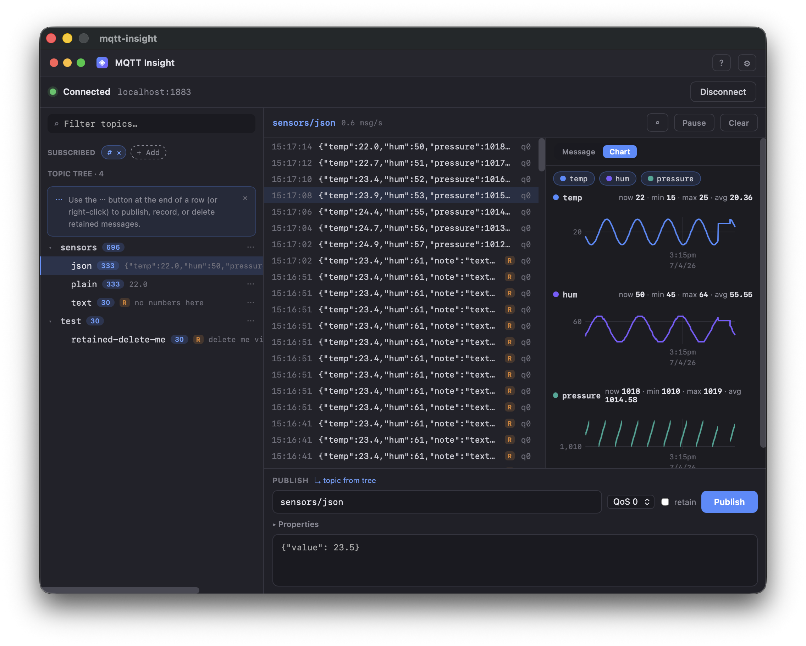
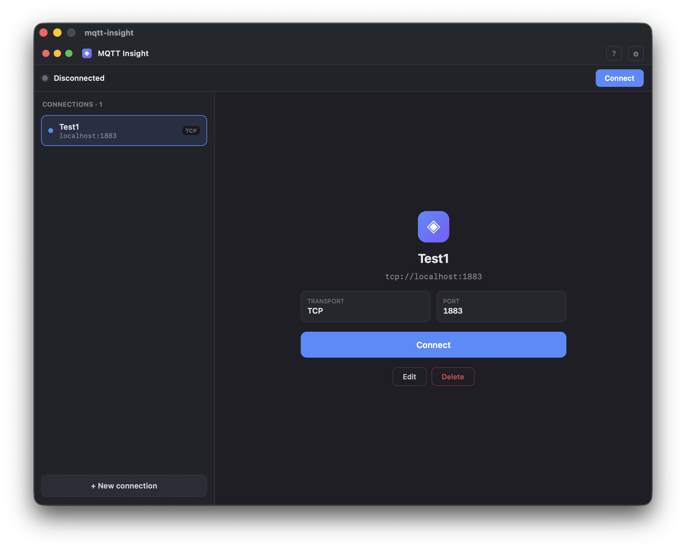

# mqtt-insight

An open-source MQTT desktop client for IoT/embedded debugging, built with Wails + Go + React.



<details>
<summary>More screenshots</summary>

**Connection launcher**



</details>

## Install

Download the latest build from [Releases](https://github.com/kenshin579/mqtt-insight/releases).

**macOS** (universal — Apple Silicon & Intel): unzip, move `mqtt-insight.app` to Applications.
The app is not code-signed yet — on first launch use right-click → Open, or run:

```bash
xattr -cr /Applications/mqtt-insight.app
```

**Windows**: run the installer (`…-installer.exe`), or use the portable zip.
If SmartScreen warns, choose "More info" → "Run anyway".

## Features

- Connection profiles over TCP / TLS / WebSocket, supporting MQTT 3.1.1 and 5.0
- Auto-aggregating topic tree built from wildcard subscriptions (`#`, `+`)
- Message history per topic with Plain / JSON / Hex / Base64 formatting
- Publish panel with QoS, retained flag, and MQTT 5.0 properties (user properties, content type, etc.)
- Optional per-topic message recording to SQLite
- Dark and light themes, configurable ring buffer size and default payload format

## Development

```bash
wails dev
```

## Build

```bash
wails build
```

## Requirements

- Go 1.25+
- Node.js (for the frontend)
- Wails v2

## Testing

```bash
# Go unit tests
go test ./...

# Go integration tests (requires a local MQTT broker at localhost:1883, e.g. Mosquitto)
go test -tags=integration ./internal/mqtt/

# Frontend tests
cd frontend && npm test
```

## Roadmap

Implemented: topic tree, value-change diff highlighting, real-time numeric payload charts with stats, per-topic recording (SQLite), MQTT 5.0 properties, ko/en i18n, dark/light/system themes.

Planned: nested JSON path charts, multi-topic chart comparison, chart/data export, mTLS. Multiple simultaneous connections are intentionally out of scope.

## License

[MIT](LICENSE)
